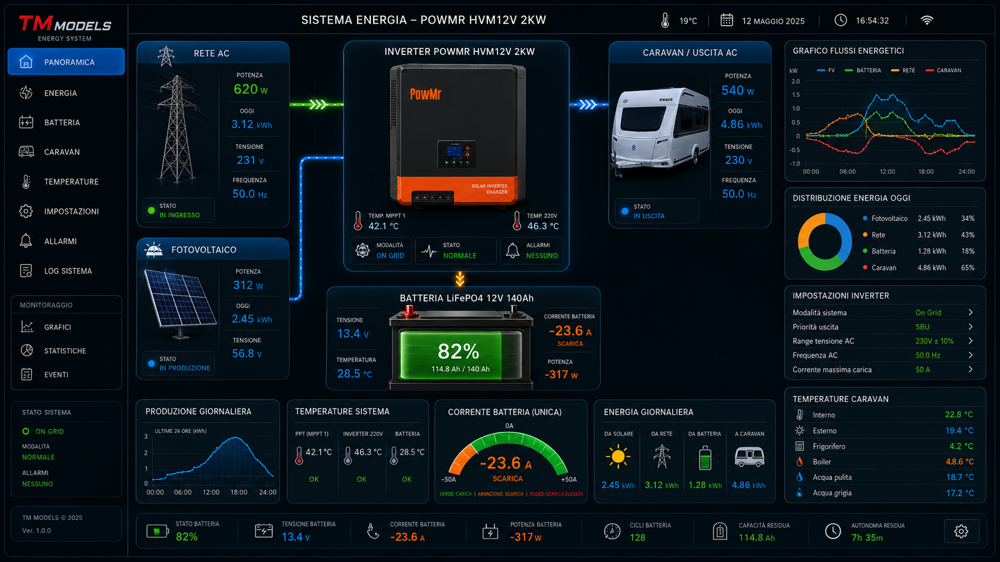

# Caravan Energy Card



Custom Lovelace card per Home Assistant pensata per monitorare l'energia di una caravan/camper con una plancia cockpit scura, ispirata ai sistemi industriali/nautici:

- flussi animati tra rete AC, fotovoltaico, inverter, batteria e carichi
- stato batteria LiFePO4 con SOC, Ah residui, corrente e potenza
- pannelli per inverter, temperature e priorita di carica/uscita
- layout completo con sidebar decorativa, topbar, grafici, donut, impostazioni e footer stato
- editor visuale Lovelace per selezionare le entita senza scrivere YAML a mano
- layout responsive per tablet e cellulare

## Installazione via HACS

Quando il progetto sara pubblicato su GitHub:

1. HACS → Frontend → menu tre puntini → Custom repositories
2. Inserisci l'URL del repository GitHub
3. Categoria: `Dashboard`
4. Installa `Caravan Energy Card`
5. Riavvia o ricarica le risorse frontend se richiesto
6. Aggiungi una nuova card Lovelace di tipo `custom:caravan-energy-card`

## Installazione manuale

Copia `caravan-energy-card.js` in:

```text
/config/www/community/caravan-energy-card/caravan-energy-card.js
```

Poi aggiungi la risorsa Lovelace:

```yaml
url: /local/community/caravan-energy-card/caravan-energy-card.js
type: module
```

## Esempio

Vedi [examples/caravan-energy-card.yaml](examples/caravan-energy-card.yaml).

Configurazione minima:

```yaml
type: custom:caravan-energy-card
title: Sistema Energia Caravan
capacity_ah: 140
entities:
  battery_soc: sensor.livello_batteria_knaus
  battery_power: sensor.batteria_knaus_potenza
  battery_current: sensor.batteria_knaus_corrente
  pv_power: sensor.powmr2kw_pv_power
  grid_power: sensor.inverter_cooling_pzem_power
  load_power: sensor.powmr2kw_load_power
```

## Entita supportate

Le entita si configurano sotto `entities`.

| Chiave | Descrizione |
| --- | --- |
| `battery_soc` | Percentuale batteria |
| `battery_voltage` | Tensione batteria |
| `battery_current` | Corrente batteria |
| `battery_power` | Potenza batteria |
| `battery_temp` | Temperatura batteria |
| `battery_runtime` | Autonomia residua |
| `battery_cycles` | Cicli batteria |
| `battery_energy` | Energia/capacita residua |
| `pv_power` | Potenza fotovoltaico |
| `pv_energy` | Produzione fotovoltaico giornaliera |
| `pv_voltage` | Tensione fotovoltaico |
| `grid_power` | Potenza rete/PZEM |
| `grid_energy` | Energia rete giornaliera |
| `grid_voltage` | Tensione rete |
| `grid_frequency` | Frequenza rete |
| `load_power` | Potenza carichi/caravan |
| `load_voltage` | Tensione uscita |
| `load_frequency` | Frequenza uscita |
| `load_percent` | Percentuale carico inverter |
| `ac_active` | Binary sensor rete AC attiva |
| `alarm` | Binary sensor allarme inverter |
| `mppt_temp` | Temperatura MPPT |
| `inverter_temp` | Temperatura inverter |
| `bay_temp` | Temperatura vano tecnico |
| `internal_temp` | Temperatura interna |
| `external_temp` | Temperatura esterna |
| `output_priority` | Priorita uscita inverter |
| `charger_priority` | Priorita carica inverter |

## Stato del progetto

Prima versione locale. Le prossime cose utili:

- anteprima con dati demo quando mancano entita
- traduzioni IT/EN
- tema chiaro/scuro configurabile
- grafico storico opzionale
- pubblicazione GitHub con release versionate per HACS
